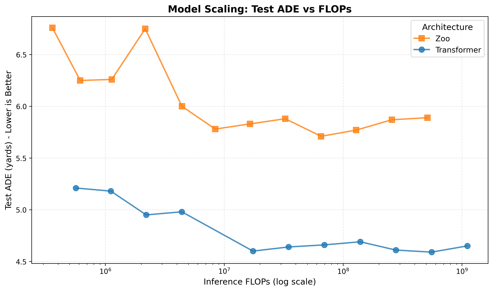
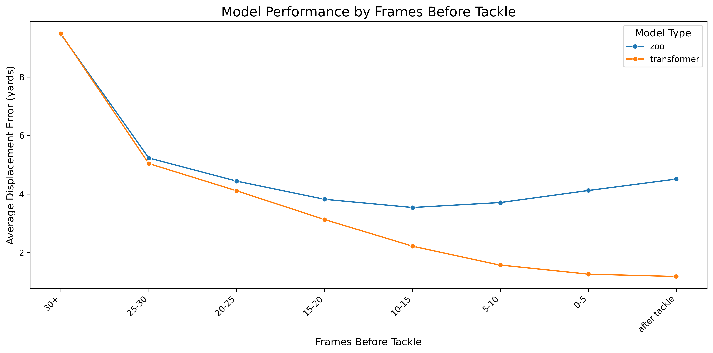

# Attention is All You Need, for Sports Tracking Data

**Transformers for sports analytics: A 20% improvement in tackle prediction using self-attention over raw player tracking data.**

## Architecture


Our Transformer operates end-to-end on raw player tracking data, naturally handling unordered collections of players and learning pairwise spatial interactions through self-attention. Unlike traditional approaches that struggle with the "player-ordering problem," this architecture treats all 22 players simultaneously, allowing each player's representation to be informed by the entire field context.

## Key Results

| Metric | Zoo Architecture | Transformer | Improvement |
|--------|------------------|-------------|-------------|
| **Test Set ADE** | 5.78 yards | **4.61 yards** | **20.2%** (1.17 yards) |
| **At Tackle Frame** | 4.07 yards | **0.98 yards** | **75.9%** (3.09 yards) |
| **Near Contact (0-5 frames)** | 4.27 yards | **1.22 yards** | **71.4%** (3.05 yards) |

**Bottom line:** The Transformer architecture dramatically outperforms traditional approaches, especially at critical moments when players are converging toward the tackle.

## Scaling Behavior: Why Architecture Matters



This visualization reveals a fundamental difference between architectures:

- **Zoo Architecture** peaks at 73K parameters (5.78 yards), then **degrades** with more capacity → 5.89 yards at 5.9M params
- **Transformer Architecture** improves with scaling: 4.95 → 4.60 → 4.61 yards
- **Even small Transformers win**: A 52K-parameter Transformer (4.95 yards) handily beats the best 73K-parameter Zoo (5.78 yards) - **14.4% better with fewer parameters**

The architectural advantage is fundamental, not just about model size. The Transformer's self-attention mechanism captures higher-order relationships between all players simultaneously, while the Zoo's fixed 10×11 grid treats interactions independently.

## The Problem We're Solving

The rapid advancement of spatial tracking technologies in sports has led to an unprecedented surge in high-quality, high-volume tracking data. While this data has catalyzed innovations in sports analytics, current methodologies struggle with a fundamental challenge: **the player-ordering problem**. Player roles and formations are fluid in team sports, making it difficult to create consistent input structures for machine learning models.

This work introduces a transformative approach by applying Transformer architectures to address these challenges, demonstrating significant improvements over commonly used architectures, particularly in generalizing to diverse game situations.

### Our Contributions

- A minimal-feature-engineering approach to handling the player-ordering problem
- An end-to-end Transformer architecture adapted for sports tracking data
- Empirical evidence showing superior generalization compared to existing methods
- Open-source implementation for reproducibility and further research

## Paper and Workshop Materials

This repository accompanies our research paper:
- **Full Paper**: [`Attention is All You Need, for Sports Tracking Data.pdf`](./paper/Attention%20is%20All%20You%20Need,%20for%20Sports%20Tracking%20Data.pdf)
- **LaTeX Source**: [`Attention is All You Need, for Sports Tracking Data.tex`](./paper/Attention%20is%20All%20You%20Need,%20for%20Sports%20Tracking%20Data.tex)
- **Workshop Slides**: [`CMSAC Workshop Notes.pdf`](./paper/CMSAC%20Workshop%20Notes.pdf) - Presented at the Carnegie Mellon Sports Analytics Conference

---

# Detailed Results

## Metric: Average Displacement Error (ADE)

**ADE** measures the mean Euclidean distance in yards between predicted and actual tackle locations.

$$\text{ADE} = \frac{1}{N}\sum_{i=1}^{N} \sqrt{(x_{\text{pred}}^{(i)} - x_{\text{true}}^{(i)})^2 + (y_{\text{pred}}^{(i)} - y_{\text{true}}^{(i)})^2}$$

where $N$ is the number of predictions, and $(x_{\text{pred}}, y_{\text{pred}})$ and $(x_{\text{true}}, y_{\text{true}})$ are the predicted and ground truth tackle locations in yards.

This is a standard metric for spatial prediction tasks in computer vision and robotics. Lower values indicate more accurate predictions.

## Model Selection

Our goal was to compare Transformer and Zoo architectures at **similar model sizes** for a fair evaluation. We conducted a comprehensive hyperparameter sweep (model_dim ∈ {32, 128, 512}, num_layers ∈ {1, 2, 4, 8}) across both architectures, training 24 models total. However, we discovered that Zoo architecture does not benefit from scaling, necessitating comparison between the best version of each architecture.

### What We Found

**Zoo architecture does not scale well.** The best Zoo model is the relatively small **M128_L2** (73K params, 8.4M FLOPs, 5.78 yards ADE). Larger Zoo models consistently performed worse - for example, scaling up to M512_L8 (5.9M params, 514M FLOPs) resulted in **5.89 yards ADE**, actually degrading performance despite being 81× larger.

**Transformer architecture scales effectively.** The best Transformer model is **M512_L2** (6.6M params, 278M FLOPs, 4.61 yards ADE), showing clear improvements with increased model capacity.

### Fair Comparison

Given Zoo's inability to scale, we selected:
- **Zoo M128_L2**: Best Zoo configuration (73K params, 5.78 yards)
- **Transformer M512_L2**: Best Transformer configuration (6.6M params, 4.61 yards)

While these models differ in size (Transformer is 91× larger in parameters, 33× larger in FLOPs), this comparison uses the **optimal version of each architecture**.

**Importantly:** Even if we were **forced to pick a smaller Transformer** than the best Zoo model, the **Transformer M32_L4** (52K params, 2.2M FLOPs, **4.95 yards ADE**) still **handily outperforms** the best Zoo M128_L2 (73K params, 8.4M FLOPs, **5.78 yards ADE**) - an improvement of **0.83 yards (14.4%)** with fewer parameters and 4× fewer FLOPs.

This demonstrates that the Transformer's architectural advantages (self-attention over all players) are fundamental, not just a result of model size.

### Complete Model Comparison (All 24 Trained Models)

The table below shows all hyperparameter configurations tested, demonstrating that:
1. **Zoo does not scale** - performance degrades with increased capacity (↑ indicates worse performance than smaller model)
2. **Transformer scales well** - performance generally improves with increased capacity
3. **Architecture matters more than size** - small Transformers outperform large Zoo models

| Architecture | Model Dim | Layers | Params | Inference FLOPs | Test ADE (yards) | Val Loss |
|--------------|-----------|--------|--------|-----------------|------------------|----------|
| **Zoo** | 32 | 1 | 2,910 | 358K | 6.76 | 3.890 |
| **Zoo** | 32 | 2 | 5,086 | 615K | 6.25 | 3.557 |
| **Zoo** | 32 | 4 | 11,678 | 1.1M | 6.26 ↑ | 3.549 |
| **Zoo** | 32 | 8 | 24,862 | 2.2M | 6.75 ↑ | 3.933 |
| **Zoo** | 128 | 1 | 39,222 | 4.4M | 6.00 | 3.395 |
| **Zoo** | **128** | **2** | **72,502** | **8.4M** | **5.78** | **3.222** ← **Best Zoo** |
| **Zoo** | 128 | 4 | 172,598 | 16.5M | 5.83 ↑ | 3.296 |
| **Zoo** | 128 | 8 | 372,790 | 32.6M | 5.88 ↑ | 3.328 |
| **Zoo** | 512 | 1 | 599,190 | 65.3M | 5.71 | 3.229 |
| **Zoo** | 512 | 2 | 1,125,526 | 128.9M | 5.77 ↑ | 3.270 |
| **Zoo** | 512 | 4 | 2,705,558 | 257.1M | 5.87 ↑ | 3.325 |
| **Zoo** | 512 | 8 | 5,865,622 | 513.5M | 5.89 ↑ | 3.380 |
| | | | | | | |
| **Transformer** | 32 | 1 | 14,358 | 564K | 5.21 | 2.939 |
| **Transformer** | 32 | 2 | 27,062 | 1.1M | 5.18 | 2.900 |
| **Transformer** | **32** | **4** | **52,470** | **2.2M** | **4.95** | **2.753** ← **Smaller than Zoo** |
| **Transformer** | 32 | 8 | 103,286 | 4.4M | 4.98 | 2.774 |
| **Transformer** | 128 | 2 | 418,478 | 17.5M | 4.60 | 2.554 |
| **Transformer** | 128 | 4 | 815,022 | 34.8M | 4.64 | 2.558 |
| **Transformer** | 128 | 8 | 1,608,110 | 69.5M | 4.66 | 2.591 |
| **Transformer** | 512 | 1 | 3,485,838 | 139.4M | 4.69 | 2.607 |
| **Transformer** | **512** | **2** | **6,638,222** | **277.9M** | **4.61** | **2.549** ← **Best Transformer** |
| **Transformer** | 512 | 4 | 12,942,990 | 555.0M | 4.59 | 2.564 |
| **Transformer** | 512 | 8 | 25,552,526 | 1109.1M | 4.65 | 2.582 |

### Key Observations

**1. Zoo Architecture Fails to Scale:**
- Optimal at **M128_L2** (73K params → 5.78 yards)
- Scaling to **M512_L8** (5.9M params, 81× larger) → **5.89 yards** - performance degrades
- Consistent pattern: adding capacity hurts performance beyond M128_L2

**2. Transformer Architecture Scales Successfully:**
- **M32_L1** (14K params) → 5.21 yards
- **M512_L2** (6.6M params) → 4.61 yards
- Clear improvement trend with model capacity (12% better performance at 460× larger size)

**3. Architectural Superiority at Matched Sizes:**
- **Transformer M32_L4**: 52K params, 2.2M FLOPs → **4.95 yards**
- **Zoo M128_L2**: 73K params, 8.4M FLOPs → **5.78 yards**
- Transformer wins with **fewer parameters and 4× fewer FLOPs**

**4. Why Zoo Doesn't Scale:**

The Zoo architecture processes pairwise interactions between offensive (10) and defensive (11) players through a fixed 10×11 grid structure. Each interaction is treated independently, preventing the model from capturing higher-order relationships involving multiple players. Adding more parameters cannot overcome this fundamental architectural limitation.

In contrast, the Transformer's self-attention mechanism computes interactions between all 22 players simultaneously, allowing each player's representation to be informed by the entire field context. This flexible architecture naturally benefits from additional capacity, enabling the model to learn increasingly sophisticated spatial patterns.

## Overall Performance

Comparing the selected best models (Zoo M128_L2 vs Transformer M512_L2), the Transformer substantially outperforms the Zoo baseline across all data splits:

| Split | Zoo (yards) | Transformer (yards) | Improvement | Plays |
|-------|-------------|---------------------|-------------|-------|
| **Train** | 5.01 | 4.03 | **19.6%** (0.98 yards) | 8,735 |
| **Val** | 5.81 | 4.69 | **19.3%** (1.12 yards) | 1,872 |
| **Test** | 5.78 | 4.61 | **20.2%** (1.17 yards) | 1,871 |

## Test Set Performance by Event Type (Per-Frame)

This analysis shows model performance at **different moments during each play** (e.g., when the ball is snapped, when the handoff occurs, when first contact happens). Events are shown in chronological order as they occur during a typical play. The Transformer shows progressively stronger improvements as the play unfolds toward the tackle:

| Event | Zoo (yards) | Transformer (yards) | Improvement | Plays |
|-------|-------------|---------------------|-------------|-------|
| **Ball Snap** | 8.72 | 8.77 | **-0.6%** (-0.05 yards) | 958 |
| **Handoff** | 6.69 | 6.59 | **1.5%** (0.10 yards) | 887 |
| **Run** | 7.92 | 6.83 | **13.8%** (1.09 yards) | 142 |
| **Pass Arrived** | 5.13 | 4.72 | **8.0%** (0.41 yards) | 732 |
| **Pass Outcome Caught** | 4.62 | 4.22 | **8.7%** (0.40 yards) | 842 |
| **First Contact** | 4.06 | 2.88 | **29.1%** (1.18 yards) | 1,578 |
| **Out of Bounds** | 5.81 | 1.72 | **70.4%** (4.09 yards) | 272 |
| **Tackle** | 4.07 | 0.98 | **75.9%** (3.09 yards) | 1,497 |

**Key Insight:** The Transformer excels at refining predictions as plays develop. Early in the play (ball snap, handoff), both models struggle to predict the final tackle location. But as the play unfolds and contact approaches, the Transformer's self-attention mechanism captures complex spatial relationships between all players, leading to dramatically more accurate predictions at critical moments (first contact: 29.1% improvement, tackle: 75.9% improvement).

## Performance by Frames Before Tackle



This visualization shows how model performance changes as predictions are made closer to the tackle moment. The x-axis represents frames before tackle (right to left = approaching tackle), and the y-axis shows Average Displacement Error in yards.

### Key Observations

**Transformer generalizes dramatically better near the tackle:**

| Frames Before Tackle | Zoo (yards) | Transformer (yards) | Improvement |
|---------------------|-------------|---------------------|-------------|
| **After tackle** | 4.61 | 1.16 | **74.8%** (3.45 yards) |
| **0-5 frames** | 4.27 | 1.22 | **71.4%** (3.05 yards) |
| **5-10 frames** | 3.88 | 1.52 | **60.8%** (2.36 yards) |
| **10-15 frames** | 3.61 | 2.23 | **38.2%** (1.38 yards) |
| **15-20 frames** | 3.78 | 3.13 | **17.2%** (0.65 yards) |
| **20-25 frames** | 4.34 | 4.19 | **3.5%** (0.15 yards) |
| **25-30 frames** | 5.12 | 5.21 | **-1.8%** (-0.09 yards) |
| **30+ frames** | 9.57 | 9.57 | **0.0%** (0.00 yards) |

**What this reveals:**

1. **Far from tackle (30+ frames)**: Both models perform similarly poorly (~9.6 yards error). At this point, the play is just beginning and the final tackle location is highly uncertain.

2. **Approaching tackle (25-10 frames)**: The Transformer begins to show advantages (-1.8% → 38.2% improvement) as more spatial information becomes available.

3. **Near tackle (0-10 frames)**: The Transformer excels (60.8% → 71.4% improvement). Its self-attention mechanism effectively captures the converging defensive players and ball carrier trajectory.

4. **After tackle**: The Transformer maintains 74.8% improvement, demonstrating its superior ability to retroactively predict tackle locations even after the play has ended.

The plot clearly shows the Transformer's **architectural advantage scales with information availability** - as the spatial configuration of players becomes more informative about the tackle location, the Transformer's ability to model all player interactions simultaneously leads to dramatically better predictions.

## Analysis

The notebook [`results/animated_results_visualization.ipynb`](results/animated_results_visualization.ipynb) contains interactive visualizations and detailed analysis of model predictions. Example visualizations like [`results/cmc_bigrun.png`](results/cmc_bigrun.png) show specific play predictions with player tracking overlays.

---

# Repository Structure

```
sports-tracking-transformer/
├── src/                          # Source code
│   ├── models.py                 # Transformer and Zoo architecture implementations
│   ├── datasets.py               # Dataset loading and preprocessing
│   ├── train.py                  # Model training script
│   ├── prep_data.py              # Data preparation pipeline
│   ├── generate_results_summary.py  # Results analysis and summary generation
│   └── pick_best_models.py       # Best model selection logic
├── paper/                        # Research paper and materials
│   ├── Attention is All You Need, for Sports Tracking Data.pdf
│   ├── Attention is All You Need, for Sports Tracking Data.tex
│   ├── CMSAC Workshop Notes.pdf
│   └── Sumer Sports Transformer Simple Arch.jpg
├── results/                      # Pre-computed results
│   ├── results.csv                # Performance metrics
│   ├── model_comparison.json      # All 24 trained models
│   ├── frame_difference_plot.png  # Performance over time
│   ├── model_scaling_plot.png     # Scaling behavior visualization
│   ├── cmc_bigrun.png             # Example play visualization
│   └── animated_results_visualization.ipynb  # Interactive visualizations
├── dvc.yaml                      # DVC pipeline configuration
├── pipeline.md                   # Pipeline visualization (Mermaid diagram)
└── pyproject.toml                # Python dependencies (uv/pip)
```

---

# Getting Started & Reproducing Results

## Installation

This repo uses `uv` to manage python version, environment, and dependencies. Start by [installing it](https://docs.astral.sh/uv/getting-started/installation/):

```bash
# On macOS and Linux
curl -LsSf https://astral.sh/uv/install.sh | sh

# On Windows
powershell -c "irm https://astral.sh/uv/install.ps1 | iex"
```

After cloning the repo, perform these steps:

1. Run `uv sync` to create a `.venv` and install all dependencies
2. Run `source .venv/bin/activate` (or `.venv\Scripts\activate` on Windows) to activate the virtual environment

## Reproducing the Full Pipeline

The full pipeline is managed by DVC. You have two options:

### Option 1: Skip Training (Download Pre-trained Models)

To skip the ~8-12 hour training process, download all 24 pre-trained models from [GitHub Releases](https://github.com/SumerSports/SportsTrackingTransformer/releases/tag/models-v1.0) (1.45GB):

```bash
wget https://github.com/SumerSports/SportsTrackingTransformer/releases/download/models-v1.0/models.tar.zst
uv run zstd -d models.tar.zst -c | tar -xf - -C models/
rm models.tar.zst
```

This includes:
- 12 Transformer models (M32/M128/M512 × L1/L2/L4/L8)
- 12 Zoo models (M32/M128/M512 × L1/L2/L4/L8)
- Checkpoints, predictions, hyperparameters, and TensorBoard logs for each configuration

Then run the pipeline, which will skip training stages via `--skip-existing`:

```bash
uv run dvc repro
```

### Option 2: Train from Scratch

To reproduce everything from scratch (including model training):

```bash
# Run full pipeline (downloads data, trains models, generates results)
uv run dvc repro
```

This runs all stages including training 24 model configurations (~8-12 hours on GPU).

**Note:** The original NFL Big Data Bowl 2024 dataset was removed from Kaggle by the host. For reproducibility, we've hosted the dataset in [GitHub Releases](https://github.com/SumerSports/SportsTrackingTransformer/releases/tag/data-v1.0). The DVC pipeline automatically downloads it from there.

## Regenerating Results Summary

To regenerate the results analysis:
```bash
uv run python src/generate_results_summary.py
```
This generates `results.csv` (performance metrics), `model_comparison.json` (all trained models), and visualization plots.

## Monitoring Training with TensorBoard

TensorBoard provides interactive visualizations of training metrics. You can view training and validation loss curves for each of the 24 model configurations, compare performance across different hyperparameters, and monitor training progress in real-time.

```bash
uv run tensorboard --logdir models/
```

---

# Citation

If you use this work, please cite:

```bibtex
@article{ranasaria2024attention,
  title={Attention is All You Need, for Sports Tracking Data},
  author={Ranasaria, Udit and Vabishchevich, Pavel},
  journal={arXiv preprint},
  year={2024}
}
```
