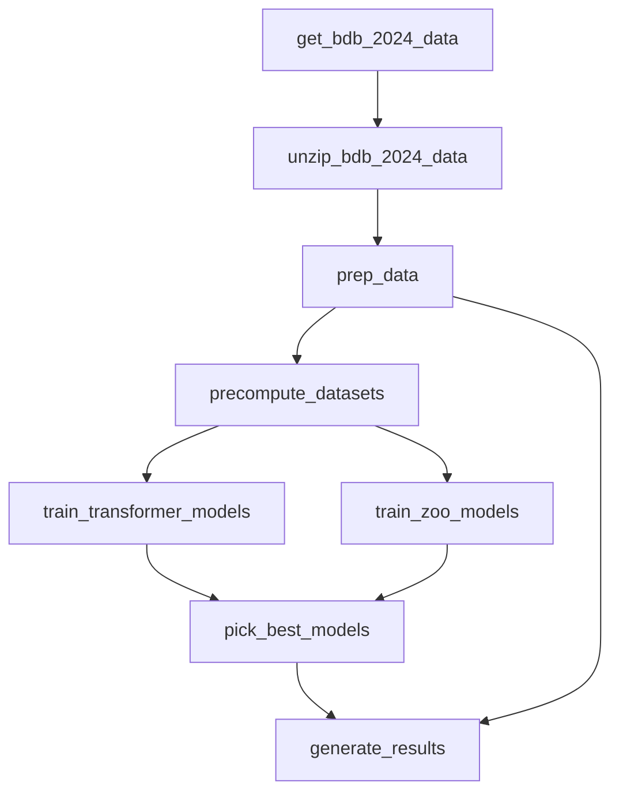

```mermaid
flowchart TD
	node1["generate_results"]
	node2["get_bdb_2024_data"]
	node3["pick_best_models"]
	node4["precompute_datasets"]
	node5["prep_data"]
	node6["train_transformer_models"]
	node7["train_zoo_models"]
	node8["unzip_bdb_2024_data"]
	node2-->node8
	node3-->node1
	node4-->node6
	node4-->node7
	node5-->node1
	node5-->node4
	node6-->node3
	node7-->node3
	node8-->node5
```
