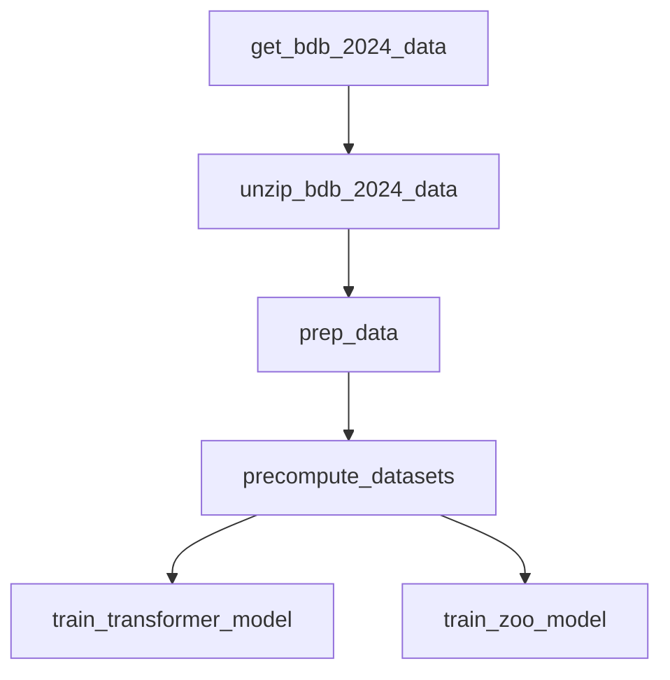

```mermaid
flowchart TD
	node1["get_bdb_2024_data"]
	node2["precompute_datasets"]
	node3["prep_data"]
	node4["train_transformer_model"]
	node5["train_zoo_model"]
	node6["unzip_bdb_2024_data"]
	node1-->node6
	node2-->node4
	node2-->node5
	node3-->node2
	node6-->node3
```
