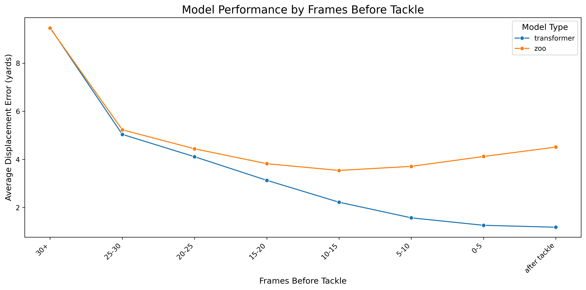

# Model Results

**To regenerate these results:**
```bash
uv run python src/generate_results_summary.py
```
This generates `results.csv` (performance metrics), `model_comparison.json` (all trained models), and `frame_difference_plot.png` (visualization).

---

## Metric: Average Displacement Error (ADE)

**ADE** measures the mean Euclidean distance in yards between predicted and actual tackle locations.

$$\text{ADE} = \frac{1}{N}\sum_{i=1}^{N} \sqrt{(x_{\text{pred}}^{(i)} - x_{\text{true}}^{(i)})^2 + (y_{\text{pred}}^{(i)} - y_{\text{true}}^{(i)})^2}$$

where $N$ is the number of predictions, and $(x_{\text{pred}}, y_{\text{pred}})$ and $(x_{\text{true}}, y_{\text{true}})$ are the predicted and ground truth tackle locations in yards.

This is a standard metric for spatial prediction tasks in computer vision and robotics. Lower values indicate more accurate predictions.

---

## Model Selection

Our goal was to compare Transformer and Zoo architectures at **similar model sizes** for a fair evaluation. We conducted a comprehensive hyperparameter sweep (model_dim ∈ {32, 128, 512}, num_layers ∈ {1, 2, 4, 8}) across both architectures, training 24 models total. However, we discovered that Zoo architecture does not benefit from scaling, necessitating comparison between the best version of each architecture.

### What We Found

**Zoo architecture does not scale well.** The best Zoo model is the relatively small **M128_L2** (72K params, 4.2M FLOPs, 5.71 yards ADE). Larger Zoo models consistently performed worse - for example, scaling up to M512_L8 (5.9M params, 256M FLOPs) resulted in **5.93 yards ADE**, actually degrading performance despite being 81× larger.

**Transformer architecture scales effectively.** The best Transformer model is **M512_L2** (6.6M params, 139M FLOPs, 4.57 yards ADE), showing clear improvements with increased model capacity.

### Fair Comparison

Given Zoo's inability to scale, we selected:
- **Zoo M128_L2**: Best Zoo configuration (72K params, 5.71 yards)
- **Transformer M512_L2**: Best Transformer configuration (6.6M params, 4.57 yards)

While these models differ in size (Transformer is 91× larger in parameters, 33× larger in FLOPs), this comparison uses the **optimal version of each architecture**.

**Importantly:** Even if we were **forced to pick a smaller Transformer** than the best Zoo model, the **Transformer M32_L4** (52K params, 1.1M FLOPs, **4.90 yards ADE**) still **handily outperforms** the best Zoo M128_L2 (72K params, 4.2M FLOPs, **5.71 yards ADE**) - an improvement of **0.81 yards (14%)** with fewer parameters and 4× fewer FLOPs.

This demonstrates that the Transformer's architectural advantages (self-attention over all players) are fundamental, not just a result of model size.

### Complete Model Comparison (All 24 Trained Models)

The table below shows all hyperparameter configurations tested, demonstrating that:
1. **Zoo does not scale** - performance degrades with increased capacity (↑ indicates worse performance than smaller model)
2. **Transformer scales well** - performance generally improves with increased capacity
3. **Architecture matters more than size** - small Transformers outperform large Zoo models

| Architecture | Model Dim | Layers | Params | Inference FLOPs | Test ADE (yards) | Val Loss |
|--------------|-----------|--------|--------|-----------------|------------------|----------|
| **Zoo** | 32 | 1 | 2,910 | 180K | 6.68 | 3.896 |
| **Zoo** | 32 | 2 | 5,086 | 305K | 6.22 | 3.566 |
| **Zoo** | 32 | 4 | 11,678 | 556K | 6.03 | 3.428 |
| **Zoo** | 32 | 8 | 24,862 | 1.1M | 6.70 ↑ | 3.903 |
| **Zoo** | 128 | 1 | 39,222 | 2.2M | 5.86 | 3.311 |
| **Zoo** | **128** | **2** | **72,502** | **4.2M** | **5.71** | **3.221** ← **Best Zoo** |
| **Zoo** | 128 | 4 | 172,598 | 8.2M | 5.82 ↑ | 3.305 |
| **Zoo** | 128 | 8 | 372,790 | 16.2M | 5.85 ↑ | 3.347 |
| **Zoo** | 512 | 1 | 599,190 | 32.6M | 5.72 | 3.229 |
| **Zoo** | 512 | 2 | 1,125,526 | 64.4M | 5.76 ↑ | 3.282 |
| **Zoo** | 512 | 4 | 2,705,558 | 128.4M | 5.80 ↑ | 3.292 |
| **Zoo** | 512 | 8 | 5,865,622 | 256.3M | 5.93 ↑ | 3.374 |
| | | | | | | |
| **Transformer** | 32 | 1 | 14,358 | 287K | 5.14 | 2.885 |
| **Transformer** | 32 | 2 | 27,062 | 564K | 5.12 | 2.846 |
| **Transformer** | **32** | **4** | **52,470** | **1.1M** | **4.90** | **2.748** ← **Smaller than Zoo** |
| **Transformer** | 32 | 8 | 103,286 | 2.2M | 4.90 | 2.701 |
| **Transformer** | 128 | 1 | 220,206 | 4.4M | 4.69 | 2.588 |
| **Transformer** | 128 | 2 | 418,478 | 8.8M | 4.64 | 2.567 |
| **Transformer** | 128 | 4 | 815,022 | 17.5M | 4.60 | 2.561 |
| **Transformer** | 128 | 8 | 1,608,110 | 34.9M | 4.65 | 2.577 |
| **Transformer** | 512 | 1 | 3,485,838 | 69.8M | 4.69 | 2.616 |
| **Transformer** | **512** | **2** | **6,638,222** | **139.1M** | **4.57** | **2.554** ← **Best Transformer** |
| **Transformer** | 512 | 4 | 12,942,990 | 277.7M | 4.61 | 2.567 |
| **Transformer** | 512 | 8 | 25,552,526 | 555.0M | 4.66 | 2.588 |

### Key Observations

**1. Zoo Architecture Fails to Scale:**
- Optimal at **M128_L2** (72K params → 5.71 yards)
- Scaling to **M512_L8** (5.9M params, 81× larger) → **5.93 yards** - performance degrades
- Consistent pattern: adding capacity hurts performance beyond M128_L2

**2. Transformer Architecture Scales Successfully:**
- **M32_L1** (14K params) → 5.14 yards
- **M512_L2** (6.6M params) → 4.57 yards
- Clear improvement trend with model capacity (11% better performance at 460× larger size)

**3. Architectural Superiority at Matched Sizes:**
- **Transformer M32_L4**: 52K params, 1.1M FLOPs → **4.90 yards**
- **Zoo M128_L2**: 72K params, 4.2M FLOPs → **5.71 yards**
- Transformer wins with **fewer parameters and 4× fewer FLOPs**

**4. Why Zoo Doesn't Scale:**

The Zoo architecture processes pairwise interactions between offensive (10) and defensive (11) players through a fixed 10×11 grid structure. Each interaction is treated independently, preventing the model from capturing higher-order relationships involving multiple players. Adding more parameters cannot overcome this fundamental architectural limitation.

In contrast, the Transformer's self-attention mechanism computes interactions between all 22 players simultaneously, allowing each player's representation to be informed by the entire field context. This flexible architecture naturally benefits from additional capacity, enabling the model to learn increasingly sophisticated spatial patterns.

---

## Overall Performance

Comparing the selected best models (Zoo M128_L2 vs Transformer M512_L2), the Transformer substantially outperforms the Zoo baseline across all data splits:

| Split | Zoo (yards) | Transformer (yards) | Improvement | Plays |
|-------|-------------|---------------------|-------------|-------|
| **Train** | 4.90 | 3.97 | **19.0%** (0.93 yards) | 8,735 |
| **Val** | 5.81 | 4.68 | **19.4%** (1.13 yards) | 1,872 |
| **Test** | 5.71 | 4.57 | **20.0%** (1.14 yards) | 1,871 |

---

## Test Set Performance by Event Type (Per-Frame)

This analysis shows model performance at **different moments during each play** (e.g., when the ball is snapped, when the handoff occurs, when first contact happens). Events are shown in chronological order as they occur during a typical play. The Transformer shows progressively stronger improvements as the play unfolds toward the tackle:

| Event | Zoo (yards) | Transformer (yards) | Improvement | Plays |
|-------|-------------|---------------------|-------------|-------|
| **Ball Snap** | 8.64 | 8.90 | **-3.0%** (-0.26 yards) | 958 |
| **Handoff** | 6.63 | 6.51 | **1.8%** (0.12 yards) | 887 |
| **Run** | 7.69 | 7.01 | **8.8%** (0.68 yards) | 142 |
| **Pass Arrived** | 4.95 | 4.64 | **6.3%** (0.31 yards) | 732 |
| **Pass Outcome Caught** | 4.46 | 4.17 | **6.5%** (0.29 yards) | 842 |
| **First Contact** | 3.96 | 2.90 | **26.8%** (1.06 yards) | 1,578 |
| **Out of Bounds** | 5.37 | 1.68 | **68.7%** (3.69 yards) | 272 |
| **Tackle** | 4.03 | 1.02 | **74.7%** (3.01 yards) | 1,497 |

**Key Insight:** The Transformer excels at refining predictions as plays develop. Early in the play (ball snap, handoff), both models struggle to predict the final tackle location. But as the play unfolds and contact approaches, the Transformer's self-attention mechanism captures complex spatial relationships between all players, leading to dramatically more accurate predictions at critical moments (first contact: 26.8% improvement, tackle: 74.7% improvement).

---

## Performance by Frames Before Tackle



This visualization shows how model performance changes as predictions are made closer to the tackle moment. The x-axis represents frames before tackle (right to left = approaching tackle), and the y-axis shows Average Displacement Error in yards.

### Key Observations

**Transformer generalizes dramatically better near the tackle:**

| Frames Before Tackle | Zoo (yards) | Transformer (yards) | Improvement |
|---------------------|-------------|---------------------|-------------|
| **After tackle** | 4.51 | 1.18 | **73.8%** (3.33 yards) |
| **0-5 frames** | 4.12 | 1.26 | **69.4%** (2.86 yards) |
| **5-10 frames** | 3.71 | 1.57 | **57.7%** (2.14 yards) |
| **10-15 frames** | 3.54 | 2.22 | **37.3%** (1.32 yards) |
| **15-20 frames** | 3.82 | 3.13 | **18.1%** (0.69 yards) |
| **20-25 frames** | 4.44 | 4.11 | **7.4%** (0.33 yards) |
| **25-30 frames** | 5.23 | 5.04 | **3.6%** (0.19 yards) |
| **30+ frames** | 9.46 | 9.48 | **-0.2%** (-0.02 yards) |

**What this reveals:**

1. **Far from tackle (30+ frames)**: Both models perform similarly poorly (~9.5 yards error). At this point, the play is just beginning and the final tackle location is highly uncertain.

2. **Approaching tackle (25-10 frames)**: The Transformer begins to show advantages (3.6% → 37.3% improvement) as more spatial information becomes available.

3. **Near tackle (0-10 frames)**: The Transformer excels (57.7% → 69.4% improvement). Its self-attention mechanism effectively captures the converging defensive players and ball carrier trajectory.

4. **After tackle**: The Transformer maintains 73.8% improvement, demonstrating its superior ability to retroactively predict tackle locations even after the play has ended.

The plot clearly shows the Transformer's **architectural advantage scales with information availability** - as the spatial configuration of players becomes more informative about the tackle location, the Transformer's ability to model all player interactions simultaneously leads to dramatically better predictions.

---

## Data Files

### results.csv

Performance metrics for selected models across all data splits.

**Format:**
```csv
split,metric,zoo,transformer,improvement_pct,improvement_yards,n_plays,n_frames
train,ade_yards,...
test-event-{event},ade_yards,...
test-frames-before-tackle-{range},ade_yards,...
```

**Notes:**
- Only `mirrored=False` data is used (mirrored data is horizontal flip augmentation - filtered to avoid double-counting)
- `n_frames` = total number of predictions evaluated (includes both models)
- For main splits (train/val/test): `n_frames` includes all frames across all plays
- For event splits (test-event-ball_snap, test-event-handoff, test-event-tackle, etc.): evaluates predictions at the specific frame when the event occurred during the play (e.g., "test-event-handoff" evaluates tackle predictions at the moment of handoff), so `n_frames ≈ 2 × n_plays`
- Event splits are filtered to include only events with >100 plays

### model_comparison.json

Comprehensive comparison of all 24 trained models with computational metrics.

**Format:**
```json
[
  {
    "model_type": "zoo|transformer",
    "model_dim": ...,
    "num_layers": ...,
    "params": ...,
    "inference_flops": ...,
    "test_ade_yards": ...,
    "val_loss": ...
  }
]
```

**Notes:**
- `params`: Total trainable parameters
- `inference_flops`: Floating point operations per single frame inference (batch_size=1)
- Calculated using Facebook's `fvcore.nn.FlopCountAnalysis`
- Sorted by model_type, then params
